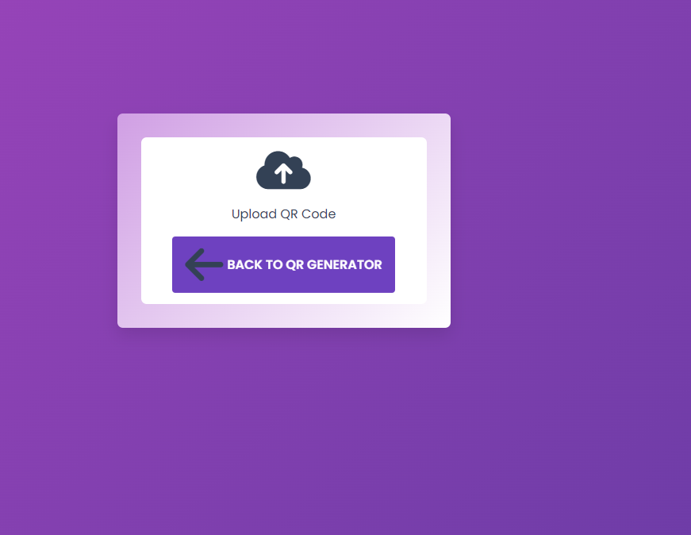

# QR Code Scanner and Generator 👾

A web application that provides QR code generation and scanning capabilities.

## Features 🚀

- Generate QR codes with custom text and settings.
- Scan QR codes using the device camera.
- Download generated QR codes as PNG images.
- Copy QR code content to the clipboard.

## Screenshots 📷

## Technologies Used 🛠️

- **HTML5** for structuring the content.
- **CSS3** for styling the user interface.
- **JavaScript** for interactivity and functionality.
- **QRCode.js** library for generating QR codes.
